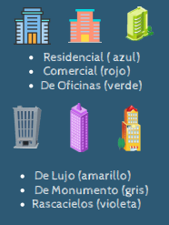
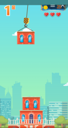
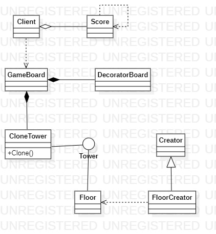
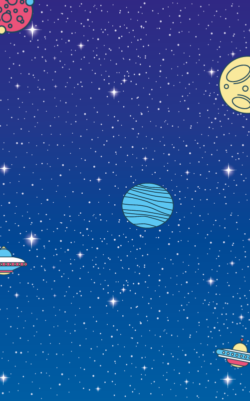
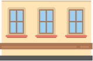
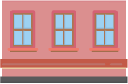

# **TOWER BLOCKS**

  - [**Idea de juego**](#idea-de-juego)
  - [**Puntuaciones en Tower Blocks**](#puntuaciones-en-tower-blocks)
  - [**Patrones implementados**](#patrones-implementados)
  - [**Diagrama de Tower Blocks**](#diagrama-de-tower-blocks)
  - [**Interfaces del juego - Diseño**](#interfaz-del-juego---diseño)
  

## **IDEA DE JUEGO**
**Tower Blocks** es un juego que consite en ir soltando unos bloques  para armar unn edificio. Se pueden construir varios tipos de edificio:

El jugador  tiene la posibilidad de desbloquear tres nuevas torres de acuerdo al progreso (el jugador empieza con la torre residencial Azul),así mismo al ir contruyendo con mayor presición, se le otorga un "techo" especial(bónus) al edificio en cuestión.

[Folleto Tower Blocks](Tower%20Blocks.pdf)

## **PUNTUACIONES EN TOWER BLOCKS**

## **PATRONES IMPLEMENTADOS**
* **Factory method**: Este patrón se
aplicará para los distintos tipos de
recuadros.

* **Singleton**:  Para acceder a los puntajes
del juego, se necesitará una única
instancia.

* **Prototype**: Este patrón se
implementará para clonar los bloques
que construirán la torre.

* **Decorator**: Es para cambiar los
escenarios de juego.

* **State**: Se implementa para cambiar la velocidad con la cuál se mueve el segmento de edificio que caerá e irá construyendo la torre.
## **DIAGRAMA DE TOWER BLOCKS**

## **INTERFAZ DEL JUEGO - DISEÑO**
### **Menú**
### **Escenarios de juego**

### **Torres**

### **Tablero de puntuaciones**
