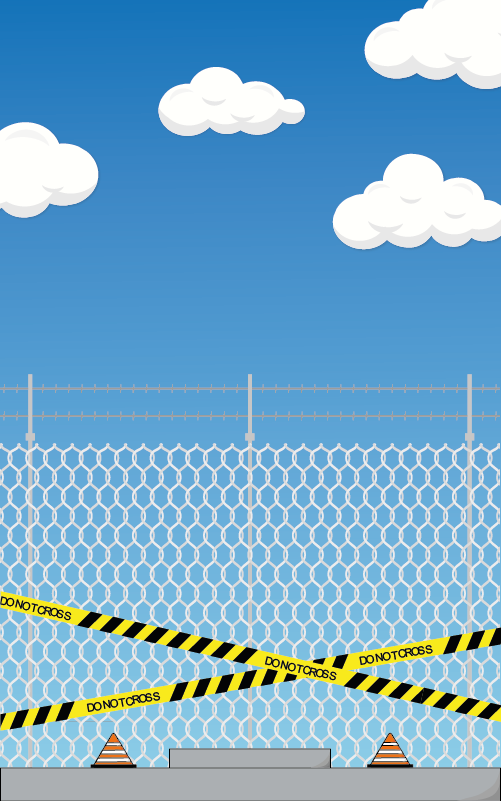

# **TOWER BLOCKS**

- [**TOWER BLOCKS**](#tower-blocks)  
  - [**INTEGRANTES**](#integrantes) 
  - [**IDEA DE JUEGO**](#idea-de-juego)
  - [**PATRONES IMPLEMENTADOS**](#patrones-implementados)
  - [**DIAGRAMA UML**](#diagrama-uml)
  - [**INTERFACES DEL JUEGO - DISEÑO**](#interfaz-del-juego---diseño)
  
  - [**¿CÓMO EJECUTAR?**](#cómo-ejecutar)
    - [**PASOS PARA INSTALAR PYTHON**](#pasos-para-instalar-python)
      - [**PARA WINDOWS O MacOS**](#para-windows-o-macos)
      - [**PARA LINUX/UNIX**](#para-linuxunix)
    - [**PASOS PARA INSTALAR PYGAME**](#pasos-para-instalar-pygame)
      - [**PARA WINDOWS**](#para-windows)
      - [**PARA UNIX**](#para-unix)
      - [**PARA MacOS**](#para-macos)

  
## **INTEGRANTES**

- Andrés David Beltrán Rojas 20182020090

- Laura Tatiana Ramírez Rodríguez 20182020098

- Javier Santiago Borbón 20182020085

## **IDEA DE JUEGO**
**Tower Blocks** es un juego que consite en ir soltando unos bloques  para armar un edificio. Se pueden obtener varios tipos de pisos:
<center>

### **PISO RESIDENCIAL**


### **PISO COMERCIAL**


### **OFICINAS**


### **PISO DE LUJO**


</center>

El jugador empieza construyendo su edificio con pisos residenciales, a medida que avanza la partida y va sumando en su puntaje, los escenarios cambian junto con los pisos que puede construir. Para hacer mucho más divertido este **Tower Blocks** la dificultad para dejar caer los pisos aumentará, permitiendo así tener una experiencia de juego mucho más divertida.

<center>


</center>

[Folleto Tower Blocks](Tower%20Blocks.pdf)


## **PATRONES IMPLEMENTADOS**
* **Factory method**: Este patrón se
aplicará para los distintos tipos de
pisos junto con su nivel de dificultad asociada.

* **Singleton**:  Para acceder a los puntajes
del juego, se necesitará una única
instancia.

* **Prototype**: Este patrón se
implementará para clonar los bloques
que construirán la torre.

* **Chain Responsability**: Se implementará este patrón para cambiar los
escenarios de juego.


## **DIAGRAMA UML**


## **INTERFAZ DEL JUEGO - DISEÑO**
### **MENÚ**

### **ESCENARIOS DE JUEGO**




### **TABLERO DE PUNTUACIONES**


## **¿CÓMO EJECUTAR?**

Para que este código funcione se debe tener instalado en el sistema Python 3.7+, y el modulo Pygame, si usted dispone de esto, podrá disfutar de una linda serenata interpretada por nuestros músicos del programa, de lo contrario siga las siguientes indicaciones:

REQUISITOS MÍNIMOS DEL SISTEMA:

- Se debe contar con un dispositivo Windows (posterior a XP), Linux/UNIX o MacOS.

- Poseer al menos de 100 Mb de espacio disponible (25 Mb del instalador y 90 Mb para funcionar).

### **PASOS PARA INSTALAR PYTHON**

#### **PARA WINDOWS O MacOS**

1. Ir al área de descargas para [Windows](https://www.python.org/downloads/windows/) o para [MacOS](https://www.python.org/downloads/mac-osx/) del sitio oficial y descargar el instalador ejecutable Python 3.8 de 32 o 64 bit.

2. Iniciar la instalación ejecutando el archivo (con privilegios) descargado Python-3.8.3. Si es necesario, confirmar la ejecución en la ventana de advertencia de seguridad de Abrir archivo.

3. Una vez iniciado el instalador, en la ventana Install Python 3.8.3 (64 bit) activar las casillas de las opciones: Install launcher for all users (recommended) y Add Python 3.8 to PATH. Después, continuar seleccionando la opción Customize installation. Choose Location and features.

4. Seguir las indicaciones del instalador.

5. En la ventana Setup was successful, una vez que ha concluido el proceso de instalación hacer clic en el botón [Close]. Desde esta ventana es posible acceder a un tutorial online de Python, a la documentación oficial del lenguaje y a información con las novedades de la presente versión.

#### **PARA LINUX/UNIX**

1. Verifique si su distribución viene con python preinstalado, para saber esto utilice el comando:

¿Tiene python inferior a 3?

```
$ python --version
```

o
¿Tiene python 3?

```
$ python3 --version
```

1. Si su respuesta a ambas preguntas no fue satisfactorio o si no posee Python 3 versión 3.7+ o una versión posterior, siga los pasos a continuación dependiendo de la versión del SO que disponga, si no conoce que versión posee ejecute el siguiente comando:

```
$ cat /etc/*version
```

En derivados de Debian, como por ejemplo Ubuntu, use apt:

```
$ sudo apt-get install python3
```

En Red Hat y sus derivados, use yum:

```
$ sudo yum install python3
```

En SUSE y sus derivados, use zypper:

```
$ sudo zypper install python3
```

3. Abra la terminal y ejecute el siguiente comando para verificar que Python está instalado correctamente.

```
$ python3 --version
```

### **PASOS PARA INSTALAR PYGAME**

1. Para poder utilizar PYGAME debes de tener, al menos, Python 3.7 instalado.
2. Para instalar PYGAME vamos a utilizar pip. Así que simplemente deberemos de escribir en nuestra línea de comandos lo siguiente:

#### **PARA WINDOWS**

```
$ py -m pip install -U pygame --user
py -m pygame.examples.aliens
```

#### **PARA UNIX**

Siga los pasos de acuerdo a su distribución:

 - **Debian/Ubuntu/Mint**

```
sudo apt-get install python3-pygame
python3 -m pygame.examples.aliens
```

 - **Fedora/Red hat**

```
sudo yum install python3-pygame
python3 -m pygame.examples.aliens
```
 - **Arch/Manjaro**

```
sudo pamac install python-pygame
python -m pygame.examples.aliens
```
#### **PARA MacOS**

 - **MacOS X o Posterior**
```
python3 -m pip install -U pygame==2.0.0.dev6 --user
python3 -m pygame.examples.aliens
```
 - **Versiones anteriores a MacOS X**

```
python -m pip install pygame
python -m pygame.examples.aliens
```

